<!-- ====================================================================== 
     README — BRENO J. OLIVEIRA · Software Engineer
     Galaxy Dark Luxury Theme · v6.0
     Paleta: Cyan #00f5ff · Purple #b44fff · Gold #ffd700 · Green #00ff88
     ====================================================================== -->

<!-- ======================== HEADER (dark/light SVG) ======================== -->

<p align="center">
  <picture>
    <source media="(prefers-color-scheme: dark)" srcset="dark.svg" />
    <source media="(prefers-color-scheme: light)" srcset="light.svg" />
    
  </picture>
</p>

<!-- ======================== CREDENTIAL BADGES ======================== -->

<p align="center">
  
  &nbsp;
  
  &nbsp;
  
</p>

<!-- ======================== TYPING SVG ======================== -->

<p align="center">
  
</p>

<!-- ======================== SOCIAL LINKS ======================== -->

<p align="center">
  <a href="https://www.linkedin.com/in/brenojoliveira/" target="_blank">
    
  </a>
  <a href="https://github.com/Breno-J-Oliveira" target="_blank">
    
  </a>
  <a href="https://www.instagram.com/brenoov" target="_blank">
    
  </a>
  <a href="https://x.com/BrenoJOliveira_" target="_blank">
    
  </a>
  <a href="mailto:breno.emailsenai@gmail.com">
    
  </a>
  <a href="https://breno-j-oliveira.github.io/Zenith/" target="_blank">
    
  </a>
</p>

<br>


<br>

<!-- ======================== ABOUT ME ======================== -->

<h2 align="center">🧑‍💻 &nbsp;Sobre Mim</h2>

<br>

> **Estudante de Desenvolvimento de Sistemas no SENAI** com base sólida em Computação Avançada e experiência prática em **sistemas backend**, **automação** e **arquitetura embarcada**.

> Construo software **estruturado, escalável e orientado a performance**, combinando entendimento de baixo nível com design de sistemas de alto nível. Minha abordagem valoriza **código limpo**, modularidade, disciplina de testes e **manutenibilidade de longo prazo**.

> Resolvo problemas reais com **pensamento de engenharia** — projetando APIs RESTful, automatizando CI/CD, integrando hardware com software e estruturando sistemas prontos para produção. **Do silício ao container Docker.**

<br>


<br>

<!-- ======================== O QUE ME DIFERENCIA ======================== -->

<h2 align="center">⚡ &nbsp;O que me diferencia</h2>

<br>

<table align="center" width="100%">
  <tr>
    <td align="center" width="50%">
      <h3>🔧 Fullstack de verdade</h3>
      <p>Do PHP puro ao NestJS. Do vanilla JS ao Next.js + TypeScript. Backend, frontend, mobile e desktop — mesma qualidade em todas as camadas.</p>
    </td>
    <td align="center" width="50%">
      <h3>🏗️ Arquitetura como prioridade</h3>
      <p>MVC, modularização, separação de responsabilidades. Cada classe, módulo e endpoint pensado para escalar desde o primeiro commit.</p>
    </td>
  </tr>
  <tr>
    <td align="center" width="50%">
      <h3>🔒 Segurança por design</h3>
      <p>JWT, Argon2id, prepared statements, CORS, rate limiting. Segurança não é feature — é fundamento em cada projeto.</p>
    </td>
    <td align="center" width="50%">
      <h3>🔌 Hardware + Software</h3>
      <p>Arduino, C/C++, sistemas embarcados, IoT. Do silício ao container Docker — domino toda a stack vertical.</p>
    </td>
  </tr>
  <tr>
    <td align="center" width="50%">
      <h3>📦 Multi-plataforma</h3>
      <p>Web (Next.js), Desktop (Tauri), Mobile (Expo/React Native). Um backend, três plataformas — arquitetura compartilhada com Turborepo.</p>
    </td>
    <td align="center" width="50%">
      <h3>📊 APIs documentadas e testadas</h3>
      <p>Swagger/OpenAPI, Jest, Vitest, Playwright. Documentação interativa e testes em todos os níveis. CI/CD automatizado com GitHub Actions.</p>
    </td>
  </tr>
</table>

<br>


<br>

<!-- ======================== ATUALMENTE CONSTRUINDO ======================== -->

<h2 align="center">🔨 &nbsp;Atualmente construindo</h2>

<br>

<p align="center">
  
  &nbsp;
  
  &nbsp;
  
</p>

<p align="center">
  Focado em finalizar o <strong>ZENITH v1.0</strong> — produtividade pessoal em 3 plataformas (Web + Desktop + Mobile) com monorepo Turborepo, backend NestJS e motor de database flexível estilo Notion.
</p>

<br>


<br>

<!-- ======================== TECH STACK ======================== -->

<h2 align="center">🛠️ &nbsp;Tech Stack Completo</h2>

<br>

<details>
<summary><strong>🎯 &nbsp;Linguagens de Programação</strong></summary>
<br>
<p align="center">
  
</p>
<p align="center">
  <sub>Python · JavaScript · TypeScript · Java · PHP · C · C++ · C# · Bash · HTML5 · CSS3</sub>
</p>
</details>

<details>
<summary><strong>⚛️ &nbsp;Frameworks, Runtimes & Plataformas</strong></summary>
<br>
<p align="center">
  
</p>
<p align="center">
  <sub>Next.js 14+ (App Router) · React 18 · NestJS · Node.js · Express · Tauri 2 · PHP 8.2</sub>
</p>
</details>

<details>
<summary><strong>🗄️ &nbsp;Banco de Dados, Cache & ORM</strong></summary>
<br>
<p align="center">
  
</p>
<p align="center">
  
  &nbsp;
  
  &nbsp;
  
</p>
<p align="center">
  <sub>PostgreSQL · MySQL 8.0 · MariaDB 10.6+ · Redis · SQLite · Prisma ORM · PDO</sub>
</p>
</details>

<details>
<summary><strong>🛡️ &nbsp;Segurança & Autenticação</strong></summary>
<br>
<p align="center">
  
  &nbsp;
  
  &nbsp;
  
  &nbsp;
  
  &nbsp;
  
</p>
<p align="center">
  <sub>JWT (HS256) · Argon2id Password Hashing · Rate Limiting · CORS Controlado · RBAC · Tenant Isolation</sub>
</p>
</details>

<details>
<summary><strong>🎨 &nbsp;Frontend & UI</strong></summary>
<br>
<p align="center">
  
</p>
<p align="center">
  
  &nbsp;
  
  &nbsp;
  
  &nbsp;
  
  &nbsp;
  
  &nbsp;
  
  &nbsp;
  
  &nbsp;
  
</p>
<p align="center">
  <sub>Tailwind CSS · shadcn/ui · Framer Motion · Chart.js 4.x · Recharts · TanStack Table v8 · Leaflet.js · Cropper.js · Font Awesome 6.4</sub>
</p>
</details>

<details>
<summary><strong>🛠️ &nbsp;DevOps, CI/CD & Ferramentas</strong></summary>
<br>
<p align="center">
  
</p>
<p align="center">
  
  &nbsp;
  
  &nbsp;
  
  &nbsp;
  
  &nbsp;
  
</p>
<p align="center">
  <sub>Docker · GitHub Actions (CI/CD) · Turborepo · Git · Linux · Arch Linux · VS Code · Figma · Apache 2.4 · Stripe · Vercel · Railway</sub>
</p>
</details>

<details>
<summary><strong>📦 &nbsp;Bibliotecas & Testes</strong></summary>
<br>
<p align="center">
  
  &nbsp;
  
  &nbsp;
  
  &nbsp;
  
  &nbsp;
  
  &nbsp;
  
  &nbsp;
  
  &nbsp;
  
  &nbsp;
  
  &nbsp;
  
  &nbsp;
  
</p>
<p align="center">
  <sub>React Hook Form · Zod · TanStack Query · Zustand · Swagger/OpenAPI · Jest · Vitest · Playwright · PHPUnit · Discord.py · NumPy</sub>
</p>
</details>

<details>
<summary><strong>🔌 &nbsp;Embedded & IoT</strong></summary>
<br>
<p align="center">
  
</p>
<p align="center">
  <sub>Arduino · C/C++ · Linux Embarcado · Raspberry Pi · Sensores · Atuadores · Protocolos de Comunicação</sub>
</p>
</details>

<details>
<summary><strong>📐 &nbsp;Padrões de Arquitetura & Engenharia</strong></summary>
<br>
<p align="center">
  
  &nbsp;
  
  &nbsp;
  
  &nbsp;
  
  &nbsp;
  
  &nbsp;
  
  &nbsp;
  
  &nbsp;
  
  &nbsp;
  
</p>
<p align="center">
  <sub>MVC · RESTful APIs · Microservices · Multi-tenant Architecture · Monorepo (Turborepo) · SOLID · Design Patterns · Clean Code · TDD · CI/CD</sub>
</p>
</details>

<br>


<br>

<!-- ======================== GITHUB STATS ======================== -->

<h2 align="center">📊 &nbsp;GitHub Analytics</h2>

<br>

<p align="center">
  
  &nbsp;
  
</p>

<br>

<p align="center">
  
</p>

<br>

<h2 align="center">⏱️ &nbsp;WakaTime Stats</h2>

<p align="center">
  
</p>

<!--START_SECTION:waka-->


**I'm an Early 🐤** 

```text
🌞 Morning                173 commits         ██████████░░░░░░░░░░░░░░░   38.62 % 
🌆 Daytime                178 commits         ██████████░░░░░░░░░░░░░░░   39.73 % 
🌃 Evening                95 commits          █████░░░░░░░░░░░░░░░░░░░░   21.21 % 
🌙 Night                  2 commits           ░░░░░░░░░░░░░░░░░░░░░░░░░   00.45 % 
```
📅 **I'm Most Productive on Thursday** 

```text
Monday                   12 commits          █░░░░░░░░░░░░░░░░░░░░░░░░   02.68 % 
Tuesday                  29 commits          ██░░░░░░░░░░░░░░░░░░░░░░░   06.47 % 
Wednesday                21 commits          █░░░░░░░░░░░░░░░░░░░░░░░░   04.69 % 
Thursday                 154 commits         █████████░░░░░░░░░░░░░░░░   34.38 % 
Friday                   113 commits         ██████░░░░░░░░░░░░░░░░░░░   25.22 % 
Saturday                 80 commits          ████░░░░░░░░░░░░░░░░░░░░░   17.86 % 
Sunday                   39 commits          ██░░░░░░░░░░░░░░░░░░░░░░░   08.71 % 
```


📊 **This Week I Spent My Time On** 

```text
🕑︎ Time Zone: America/Sao_Paulo

💬 Programming Languages: 
Markdown                 2 hrs 59 mins       ███████████░░░░░░░░░░░░░░   44.17 % 
Other                    1 hr 27 mins        █████░░░░░░░░░░░░░░░░░░░░   21.56 % 
TypeScript               50 mins             ███░░░░░░░░░░░░░░░░░░░░░░   12.50 % 
YAML                     37 mins             ██░░░░░░░░░░░░░░░░░░░░░░░   09.14 % 
Bash                     32 mins             ██░░░░░░░░░░░░░░░░░░░░░░░   07.96 % 

🔥 Editors: 
VS Code                  6 hrs 47 mins       █████████████████████████   100.00 % 

💻 Operating System: 
Windows                  6 hrs 47 mins       █████████████████████████   100.00 % 
```


<!--END_SECTION:waka-->

<br>

<p align="center">
  
  &nbsp;
  
</p>

<br>

<p align="center">
  
</p>

<br>

<!-- ======================== JET HEATMAP ======================== -->

<p align="center">
  
</p>

<br>

<!-- ======================== SNAKE ANIMATION ======================== -->

<p align="center">
  <picture>
    <source media="(prefers-color-scheme: dark)" srcset="https://raw.githubusercontent.com/Breno-J-Oliveira/Breno-J-Oliveira/output/github-snake-dark.svg" />
    <source media="(prefers-color-scheme: light)" srcset="https://raw.githubusercontent.com/Breno-J-Oliveira/Breno-J-Oliveira/output/github-snake.svg" />
    
  </picture>
</p>

<br>

<p align="center">
  
</p>

<br>


<br>

<!-- ======================== PROJETOS EM DESTAQUE ======================== -->

<h2 align="center">⭐ &nbsp;Projetos em Destaque</h2>

<br>

<p align="center">
  <a href="https://github.com/Breno-J-Oliveira/PROJETO-ARQUON">
    
  </a>
  <a href="https://github.com/Breno-J-Oliveira/Zenith">
    
  </a>
</p>

<br>

<!-- ARQON DETALHES -->
<h3 align="center">
  
  &nbsp;ARQON — THE VAULT
</h3>

<p align="center">
  
  
  
  
  
  
  
  
</p>

<p align="center">
  Plataforma full-stack de locação de roupas e artefatos de luxo. MVC em PHP 8.2 puro, 80+ endpoints REST, autenticação JWT com Argon2id, 8 temas dinâmicos, painel admin com métricas Chart.js.
</p>

<p align="center">
  ✅ Catálogo com filtros avançados · ✅ Carrinho + Checkout · ✅ Painel Admin completo · ✅ SPA-like navigation
</p>

<p align="center">
  <a href="https://github.com/Breno-J-Oliveira/PROJETO-ARQUON" target="_blank">
    
  </a>
</p>

<br>

<!-- ZENITH DETALHES -->
<h3 align="center">
  
  &nbsp;ZENITH — Organização Pessoal
</h3>

<p align="center">
  
  
  
  
  
  
  
  
  
</p>

<p align="center">
  Produtividade pessoal em 3 plataformas (Web + Desktop + Mobile) com backend único em NestJS. Monorepo com Turborepo. Motor de database flexível estilo Notion com propriedades tipadas e múltiplas views.
</p>

<p align="center">
  ✅ Dashboard com KPIs · ✅ Timeline do dia · ✅ CRUD de Metas/Tarefas/Rotinas · ✅ Calendário FullCalendar drag-and-drop · ✅ Database flexível · ✅ Command Palette (Ctrl+Shift+P) · ✅ Busca Global (Ctrl+K)
</p>

<p align="center">
  <a href="https://github.com/Breno-J-Oliveira/Zenith" target="_blank">
    
  </a>
</p>

<br>


<br>

<!-- ======================== ROADMAP ======================== -->

<h2 align="center">🚀 &nbsp;Roadmap de Projetos</h2>

<br>

<table align="center" width="100%">
  <tr>
    <td align="center" width="50%" style="background-color:#0d0d0d; padding:20px">
      <h3>🏢 ERP Cloud — SaaS Multiempresa</h3>
      <p>ERP completo multi-tenant com 15+ módulos de gestão empresarial, Stripe billing, RBAC e isolamento de dados via Prisma middleware.</p>
      
      
      
      
      <br><br>
      
    </td>
    <td align="center" width="50%" style="background-color:#0d0d0d; padding:20px">
      <h3>🎓 TCC SENAI — Aplicação Fullstack</h3>
      <p>Trabalho de Conclusão de Curso com documentação técnica completa, diagramas, Swagger, testes Jest + Playwright e CI/CD.</p>
      
      
      
      
      <br><br>
      
    </td>
  </tr>
</table>

<br>


<br>

<!-- ======================== FILOSOFIA ======================== -->

<h2 align="center">🧠 &nbsp;Filosofia de Engenharia</h2>

<br>

<p align="center">
  <em>
    "Engenharia de software é a arte de equilibrar complexidade com clareza.<br>
    Cada sistema que construo é uma ponte entre o que o usuário precisa e o que a tecnologia pode oferecer —<br>
    sem atalhos, sem dívida técnica, sem código descartável."
  </em>
</p>

<p align="center">
  <sub>— Breno J. Oliveira</sub>
</p>

<br>


<br>

<!-- ======================== FOOTER ======================== -->

<p align="center">
  
</p>

<p align="center">
  
</p>